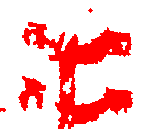

# GMM-SLIC-RustDetction
Official implementation for ["Automatic Rust Segmentation Using Gaussian Mixture Model and Superpixel Segmentation"](https://ieeexplore.ieee.org/document/9991284) published in [IEEE HDIS 2022 Conference](https://ieeexplore.ieee.org/xpl/conhome/9991245/proceeding).

This is a novel rust segmentation approach based on the Gaussian mixture model (GMM) and SLIC superpixel segmentation.

Training code, testing code, and testing images are provided. For the training images and the pre-trained models (including `GMMmodel_RGB.pkl`, `GMMmodel_HSV.pkl`, and `GMMmodel_Combine.pkl`), please contact yangzhixinluo@link.cuhk.edu.cn.

For commercial use, please also contact yangzhixinluo@link.cuhk.edu.cn.

## Citation
Please cite our [IEEE HDIS 2022 paper](https://ieeexplore.ieee.org/document/9991284) when using this code:
```
@INPROCEEDINGS{9991284,
  author={Yang, Jingyuan and Luo, Yangzhixin and Zhou, Zhixiang and Li, Nan and Fu, Ruiqing and Zhang, Xiaoguang and Ding, Ning},
  booktitle={2022 International Conference on High Performance Big Data and Intelligent Systems (HDIS)}, 
  title={Automatic Rust Segmentation Using Gaussian Mixture Model and Superpixel Segmentation}, 
  year={2022},
  volume={},
  number={},
  pages={71-78},
  doi={10.1109/HDIS56859.2022.9991284}}
```

## Preparation
Install required dependencies:
```sh
pip install -r requirements.txt
```
Make a new directory `./model` under the working directory for the trained models that will be generated by training:
```sh
cd GMM-SLIC-RustDetction # go to the working directory that you put this project in
mkdir model
```
Make a new directory `./output` under the working directory for the output images that will be generated by testing:
```sh
mkdir output
```

## Usage of Training/Testing Code
The files under [`training/`](https://github.com/lyzx2001/GMM-SLIC-RustDetction/blob/master/training) directory are used to train the GMM model, with the following features:
* [`training/train_GMM_RGB.py`](https://github.com/lyzx2001/GMM-SLIC-RustDetction/blob/master/training/train_GMM_RGB.py): Training code for GMM model using RGB features.
* [`training/train_GMM_HSV.py`](https://github.com/lyzx2001/GMM-SLIC-RustDetction/blob/master/training/train_GMM_HSV.py): Training code for GMM model using HSV features.
* [`training/train_GMM_Combine.py`](https://github.com/lyzx2001/GMM-SLIC-RustDetction/blob/master/training/train_GMM_Combine.py): Training code for GMM model using RGB+HSV features.

The files under [`testing/`](https://github.com/lyzx2001/GMM-SLIC-RustDetction/blob/master/testing) directory are used to test the GMM model with SLIC superpixel segmentation, and generate output images, with the following features:
* [`testing/test_RGB_SLIC.py`](https://github.com/lyzx2001/GMM-SLIC-RustDetction/blob/master/testing/test_RGB_SLIC.py): Testing code with SLIC segmentation for GMM model using RGB features.
* [`testing/test_HSV_SLIC.py`](https://github.com/lyzx2001/GMM-SLIC-RustDetction/blob/master/testing/test_HSV_SLIC.py): Testing code with SLIC segmentation for GMM model using HSV features.
* [`testing/test_Combine_SLIC.py`](https://github.com/lyzx2001/GMM-SLIC-RustDetction/blob/master/testing/test_Combine_SLIC.py): Testing code with SLIC segmentation for GMM model using RGB+HSV features.

## Training
Train GMM model using RGB features:
```sh
python training/train_GMM_RGB.py --train_path=<your-training-images-directory-path>
```
Train GMM model using HSV features:
```sh
python training/train_GMM_HSV.py --train_path=<your-training-images-directory-path>
```
Train GMM model using RGB+HSV features:
```sh
python training/train_GMM_Combine.py --train_path=<your-training-images-directory-path>
```
Example:
```sh
python training/train_GMM_HSV.py --train_path="./train_images"
```

## Testing
Test with SLIC segmentation for GMM model using RGB features:
```sh
python testing/test_RGB_SLIC.py --test_img_path=<your-testing-image-path>
```
Test with SLIC segmentation for GMM model using HSV features:
```sh
python testing/test_HSV_SLIC.py --test_img_path=<your-testing-image-path>
```
Test with SLIC segmentation for GMM model using RGB+HSV features:
```sh
python testing/test_Combine_SLIC.py --test_img_path=<your-testing-image-path>
```
Example:
```sh
python testing/test_HSV_SLIC.py --test_img_path="./test_images/test2.png"
```

## Output
### Training Output
The trained model `.pkl` file (according to which training file you ran) will be generated under `./model` in the working directory:
* `GMMmodel_RGB.pkl`: The trained model using RGB features.
* `GMMmodel_HSV.pkl`: The trained model using HSV features.
* `GMMmodel_Combine.pkl`: The trained model using RGB+HSV features.

### Testing Output
All the output images will be generated under `./output` in the working directory, including (take running `testing/test_HSV_SLIC.py` as example):
* `HeatMap_GMM_HSV.png`: The heat image (visualized probabilities) predicted by the GMM model.
* `SLIC_Black_HSV.png`: The SLIC superpixel segmentation output (black background) of the original input image.
* `SLIC_White_HSV.png`: The SLIC superpixel segmentation output (white background) of the original input image.
* `SLIC_HSV.png`: The SLIC superpixel segmentation output (original background) of the original input image.
* `Final_Img_HSV.png`: The final segmentation output with rust detected in red and original background.
* `Binary_Img_HSV.png`: The binary segmentation output with rust detected in red and background in white.

## Sample 
### Testing Input
<center>
    <a href="https://github.com/lyzx2001/GMM-SLIC-RustDetction/blob/master/sample_images/Input_Img.png">
	    
    </a>
    <br/>
	<font color="AAAAAA">Input_Img.png</font>
</center>
<br/>

### Testing Output
<center>
    <a href="https://github.com/lyzx2001/GMM-SLIC-RustDetction/blob/master/sample_images/HeatMap_GMM_HSV.png">
	    
    </a>
    <br/>
	<font color="AAAAAA">HeatMap_GMM_HSV.png</font>
</center>
<br/>

<center>
    <a href="https://github.com/lyzx2001/GMM-SLIC-RustDetction/blob/master/sample_images/SLIC_Black_HSV.png">
	    
    </a>
	&emsp;&emsp;
    <a href="https://github.com/lyzx2001/GMM-SLIC-RustDetction/blob/master/sample_images/SLIC_White_HSV.png">
	    
    </a>
	<br/>
	<font color="AAAAAA">SLIC_Black_HSV.png</font>
	&emsp;&emsp;&emsp;&emsp;
	<font color="AAAAAA">SLIC_White_HSV.png</font>
</center>
<br/>

<center>
    <a href="https://github.com/lyzx2001/GMM-SLIC-RustDetction/blob/master/sample_images/SLIC_HSV.png">
	    
    </a>
    <br/>
	<font color="AAAAAA">SLIC_HSV.png</font>
</center>
<br/>

<center>
    <a href="https://github.com/lyzx2001/GMM-SLIC-RustDetction/blob/master/sample_images/Final_Img_HSV.png">
	    
    </a>
	&emsp;&emsp;
    <a href="https://github.com/lyzx2001/GMM-SLIC-RustDetction/blob/master/sample_images/Binary_Img_HSV.png">
	    
    </a>
	<br/>
	<font color="AAAAAA">Final_Img_HSV.png</font>
	&emsp;&emsp;&emsp;&emsp;
	<font color="AAAAAA">Binary_Img_HSV.png</font>
</center>
<br/>

## Remarks
1. We have supported the image formats including `PNG`, `JPG`, `JPEG`, `png`, `jpg`, `jpeg` for the training and testing images.
2. If your environment does not support GUI display (like when running on remote servers), just comment out all the lines of `cv2.imshow(...)`, `cv2.waitKey(0)`, `cv2.destroyAllWindows()`.
3. Notice that do not comment out the lines of `cv2.imwrite(...)`, otherwise you will not get the output images under `./output` in the working directory.
